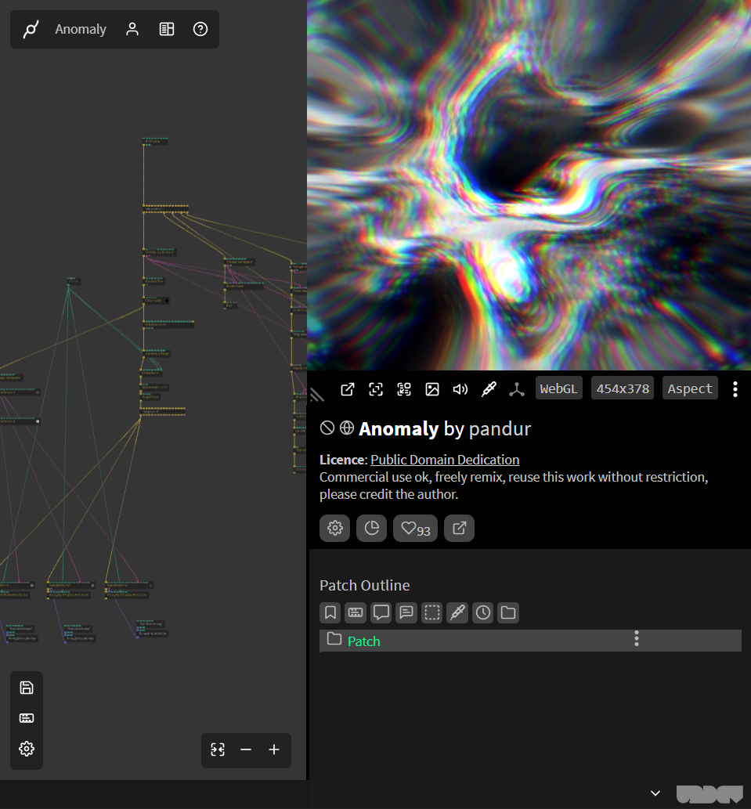

<div align="center">

# 🎨 Cables-RL MCP Server

**Train AI to create art autonomously**

[](https://www.npmjs.com/package/cables-rl-mcp)
[](https://opensource.org/licenses/MIT)
[](https://modelcontextprotocol.io)
[](https://www.typescriptlang.org/)

*An MCP server that integrates [Cables.gl](https://cables.gl) visual programming with Reinforcement Learning for autonomous visual parameter optimization and generative art exploration.*

[Features](#features) • [Installation](#installation) • [Quick Start](#quick-start) • [Documentation](#documentation) • [Examples](#examples)

---



</div>

## 🌟 What is Cables-RL?

Cables-RL connects **Claude Code** with **Cables.gl** (a powerful visual shader system) and **Reinforcement Learning**, allowing AI agents to:

- 🎯 **Discover** aesthetically interesting shader parameters automatically
- 🔄 **Optimize** visual outputs using reward-based learning
- 🖼️ **Generate** unique generative art by exploring parameter spaces
- 📊 **Learn** what looks "good" through aesthetic reward functions

Think of it as an **autonomous visual artist** that explores the creative possibilities of your Cables.gl patches.

## ✨ Features

| Feature | Description |
|---------|-------------|
| 🎮 **Real-time Control** | Modify Cables.gl parameters via browser automation |
| 🧠 **RL Integration** | Support for PPO, SAC, and TD3 algorithms |
| 🎨 **Aesthetic Rewards** | Multi-component reward function (entropy, color harmony, motion coherence) |
| 🔍 **Novelty Exploration** | Bonus rewards for discovering new visual territories |
| 💾 **Session Persistence** | Save/resume exploration sessions |
| 📸 **Auto-capture** | Automatically save high-reward frames |
| ⚡ **High Performance** | <0.01ms reward calculation, <0.2ms action generation |

## 🏗️ Architecture

```
┌─────────────────────────────────────────────────────────────┐
│                    Claude Code (Client)                      │
│                                                              │
│  Your prompts  ←→  cables-rl MCP  ←→  Playwright MCP        │
└─────────────────────────────────────────────────────────────┘
                            │
              ┌─────────────┼─────────────┐
              ▼             ▼             ▼
      ┌───────────┐  ┌───────────┐  ┌───────────┐
      │   RL      │  │ Cables.gl │  │  Reward   │
      │  Agent    │  │  Browser  │  │  System   │
      │(PPO/SAC)  │  │  Control  │  │(Aesthetic)│
      └───────────┘  └───────────┘  └───────────┘
```

## 📦 Installation

### Prerequisites

- Node.js 18+
- Python 3.8+
- [Claude Code](https://claude.ai/download) CLI

### Quick Install

```bash
# Clone the repository
git clone https://github.com/adkr1989/cables-rl-mcp.git
cd cables-rl-mcp

# Install Node.js dependencies
npm install

# Install Python dependencies
pip install numpy

# Build the project
npm run build
```

### Configure Claude Code

Add to your Claude Code MCP settings (`~/.claude.json` or project settings):

```json
{
  "mcpServers": {
    "cables-rl": {
      "type": "stdio",
      "command": "node",
      "args": ["/path/to/cables-rl-mcp/dist/index.js"],
      "env": {
        "PYTHON_PATH": "python",
        "OUTPUT_DIR": "/path/to/cables-rl-mcp/output"
      }
    },
    "playwright": {
      "type": "stdio",
      "command": "npx",
      "args": ["-y", "@playwright/mcp@latest"]
    }
  }
}
```

## 🚀 Quick Start

### 1. Load a Cables.gl Patch

In Claude Code, ask:

```
Load the Anomaly patch from Cables.gl and show me what parameters are available
```

### 2. Explore Parameters

```
Change the blur amount to 15 and the chromatic aberration to 8, then take a screenshot
```

### 3. Initialize RL Agent

```
Initialize an SAC agent to optimize the Timer speed (0-5) and Blur amount (0-20) for aesthetic visuals
```

### 4. Run Autonomous Exploration

```
Run autonomous exploration for 5 minutes, saving any interesting frames
```

## 🛠️ MCP Tools

### Cables.gl Control

| Tool | Description |
|------|-------------|
| `cables_load_patch` | Load a Cables.gl patch in the browser |
| `cables_set_parameter` | Set a parameter value in real-time |
| `cables_get_parameters` | Get all available parameters |
| `cables_batch_set_parameters` | Set multiple parameters efficiently |
| `cables_get_frame_metrics` | Capture frame and compute visual metrics |

### RL Agent

| Tool | Description |
|------|-------------|
| `rl_init_agent` | Initialize RL agent (PPO/SAC/TD3) |
| `rl_get_action` | Get next action from agent |
| `rl_update_reward` | Send reward signal to agent |
| `rl_training_step` | Execute training step(s) |
| `rl_save_checkpoint` | Save agent state |
| `rl_load_checkpoint` | Load agent state |

### Autonomous Exploration

| Tool | Description |
|------|-------------|
| `rl_autonomous_explore` | Run autonomous visual exploration |
| `rl_stop_exploration` | Stop running exploration |
| `rl_get_exploration_status` | Get exploration status |

## 🎨 Reward System

The aesthetic reward function combines multiple components:

```python
reward = (
    0.3 * entropy_score +      # Visual complexity
    0.2 * color_harmony +      # Color distribution
    0.2 * motion_coherence +   # Smooth motion
    0.2 * novelty_bonus -      # Exploration bonus
    0.1 * fps_penalty          # Performance penalty
)
```

| Component | Description |
|-----------|-------------|
| **Entropy Score** | Rewards balanced visual complexity (not too simple, not noise) |
| **Color Harmony** | Rewards balanced color distribution |
| **Motion Coherence** | Rewards smooth, intentional motion over jitter |
| **Novelty Bonus** | Bonus for exploring new parameter regions |
| **FPS Penalty** | Penalizes parameter combos that hurt performance |

## 📊 Performance

| Metric | Result |
|--------|--------|
| Reward calculation | 0.007 ms |
| Action generation | 0.14 ms |
| Theoretical training rate | 150+ steps/sec |
| Cables.gl FPS | 145 FPS |

## 📁 Project Structure

```
cables-rl-mcp/
├── src/
│   ├── index.ts              # MCP server entry point
│   ├── types.ts              # TypeScript definitions
│   ├── tools/
│   │   ├── cables-control.ts # Cables.gl browser automation
│   │   ├── rl-agent.ts       # RL agent bridge
│   │   ├── reward-system.ts  # Visual metrics & rewards
│   │   └── training-loop.ts  # Autonomous training
│   └── bridge/
│       └── python-bridge.ts  # Python process communication
├── python/
│   ├── agent_wrapper.py      # RL agent wrapper
│   ├── reward_functions.py   # Aesthetic reward calculations
│   └── env_cables.py         # Gym environment
├── package.json
├── tsconfig.json
└── README.md
```

## 🤝 Contributing

Contributions are welcome! Please feel free to submit a Pull Request.

1. Fork the repository
2. Create your feature branch (`git checkout -b feature/AmazingFeature`)
3. Commit your changes (`git commit -m 'Add some AmazingFeature'`)
4. Push to the branch (`git push origin feature/AmazingFeature`)
5. Open a Pull Request

## 📜 License

This project is licensed under the MIT License - see the [LICENSE](LICENSE) file for details.

## 🙏 Acknowledgments

- [Cables.gl](https://cables.gl) - Visual programming platform
- [Model Context Protocol](https://modelcontextprotocol.io) - MCP specification
- [Playwright](https://playwright.dev) - Browser automation

---

<div align="center">

**Made with ❤️ by [A_Development](https://github.com/adkr1989)**

*Empowering AI creativity through visual exploration*

</div>
